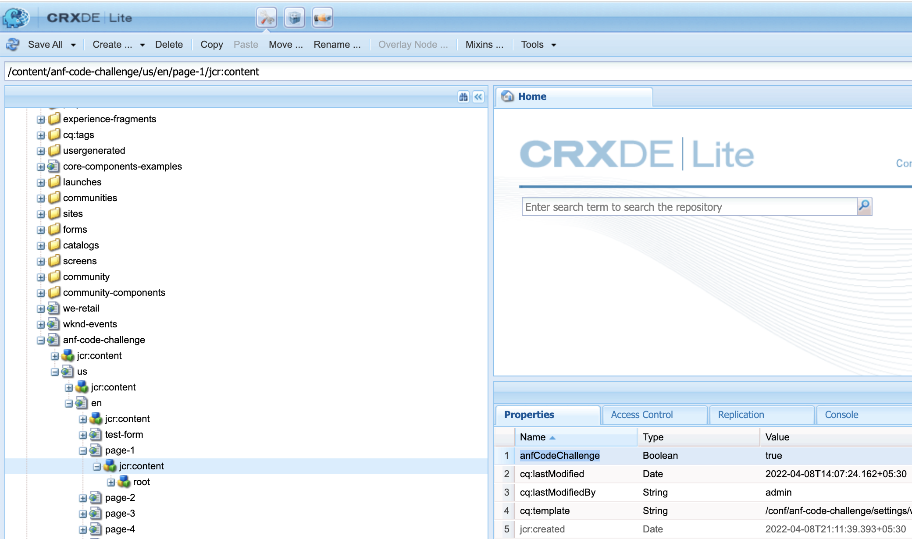

# Abercrombie AEM Developer Skill Assessment
1. Clone this repository.
2. Complete exercises below by creating/modifying code. You can architect the project how you like re: folder structure, how you name your files, etc. Use your best judgement as a developer.
3. Push the code to your own public Git repository, and send the link to your recruiter / rep.
4. Pretend your code is going into a `PRODUCTION` environment, or that you are writing a pull request for an established open source project. Do not rush these exercises or cut corners in the name of speed. We aren't interested in the code you can write under pressure; no one writes amazing code when they are rushing. This is your chance to show off. Write your best code.
5. This exercise is to be completed without coaching or other outside assistance. Obviously, you may feel free to use whatever online resources you like -- `StackOverflow` etc. -- but it is not acceptable to utilize other developers to help you finish this task.

## Exercise 1: Saving data into JCR

A form has the following fields: First Name, Last Name, Age, Country and a Submit button. A validation check is done when the user enters details and clicks on submit button. For the validation, fetch the node details /etc/age, having min and max age. If the user entered age lies in between the min and max value, all the user details will be saved inside JCR (under `/var/anf-code-challenge`) otherwise, an error message will be displayed with following text `You are not eligible`.

### Acceptance Criteria:
1. Fetch node details from /etc/age having properties: `minAge` and `maxAge`.
2. When submit button is clicked, validate the age and save the user details on a node under `/var/anf-code-challenge` after successful validation.
3. Populate the dialog dropdown (country component) dynamically using `JSON` in DAM.

### Notes:
1. Please refer to `exercises/Exercise-1` folder and deploy `Exercise-1.zip` onto your `AEM 6.5.0`
2. Please make use of skeleton code in `custombutton.js` to handle the submit button click and call `UserServlet.java` to perform the required validations.

## Exercise 2: News Feed Component

Every news feed item displays the following attributes:
1.	Title
2.	Author
3.	Current date
4.	Text/Description
5.	Image

### Node structure:

### Acceptance Criteria:

1.	Create news feed component following Adobe’s best practices.
2.	Read the news data under `/var/commerce/products/anf-code-challenge/newsData` and display it in the component.
3.	Write Unit test cases for the backend code using  [AEM Mocks](https://wcm.io/testing/aem-mock/usage.html)

### Notes:
1. Please refer to `exercises/Exercise-2` folder and deploy `Exercise-2.zip` onto your `AEM 6.5.0`

## Exercise 3: Query JCR

Fetch the first 10 pages under a given path `/content/anf-code-challenge/us/en` based on a property `anfCodeChallenge`.

### Acceptance Criteria:
1. Write a query to fetch first 10 pages, be it: `XPath`, `SQL2` or `QueryBuilder`.
2. Follow Adobe's best practices for better performance.

### Notes:
1. Please refer to `exercises/Exercise-3` folder and deploy `Exercise-3.zip` onto your `AEM 6.5.0`

## Exercise 4: Saving a property on the page creation

When a page is created, a property is saved at the page level.

### Acceptance Criteria:
1. Create a page under `/content/anf-code-challenge/us/en`.
2. As soon as the page is created, a property `pageCreated: {Boolean}true` should be saved on it.